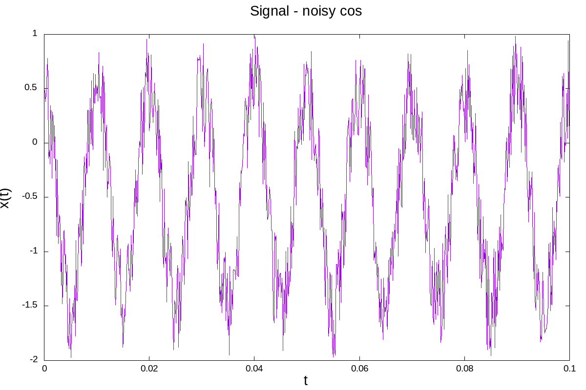
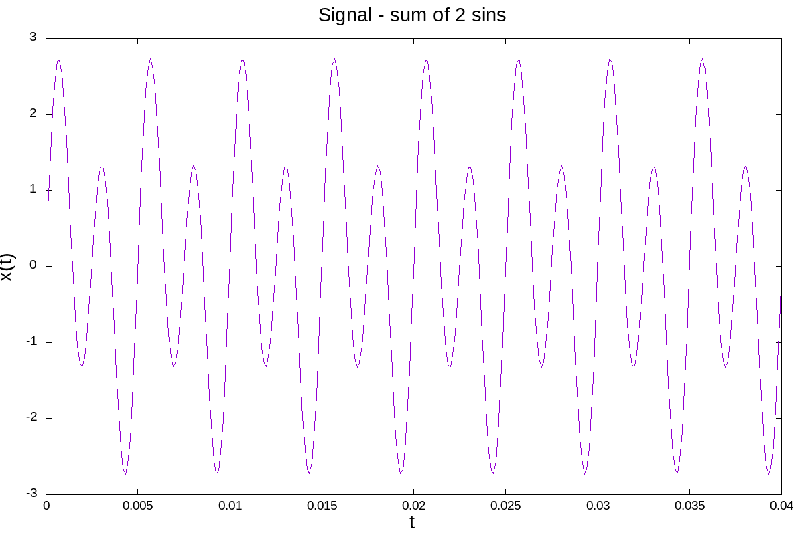

# Fortran - DFT z wykorzystaniem biblioteki FFTW
## Autor: Jakub Pilch
---
## 1. Strutkura projektu

Struktura projektu wygląda następująco:

    .
    ├── LICENSE
    ├── Makefile
    ├── README.md
    ├── res
    │   ├── filtered_cos_signal.png
    │   ├── filtered_cos_signal.txt
    │   ├── signal_cos_fft.png
    │   ├── signal_cos_noisy_fft.txt
    │   ├── signal_cos_noisy.png
    │   ├── signal_cos_noisy.txt
    │   ├── signal_sin_fft.png
    │   ├── signal_sin.png
    │   ├── signal_sin_sum_fft.txt
    │   └── signal_sin_sum.txt
    └── src
        ├── config.ff90
        ├── fftw.F90
        ├── main.F90
        ├── plots.plt
        └── utility.F90

### Katalogi zawierają:

+ **src** - kod źródłowy zadania oraz skrypt gnuplot rysujący wykresy
+ **res** - wyniki przeprowadzonych obliczeń oraz wykresy

### Opis plików:

+ **config.ff90** - zawiera definicje precyzji próbkowania oraz liczby \Pi
+ **fftw.f90** - moduł dołączający interfejs biblioteki **FFTW**
+ **main.F90** - program główny
+ **utility.F90** - implementacja funkcji użytych w programie
+ **plots.plt** - skrypt rysujący wykresy

## 2. Kompilacja i uruchamianie

    $ make all
    $ ./main.out
    $ gnuplot src/plots.plt

## 3. Sprawozdanie

Zgodnie z poleceniem do obliczenia transformaty Fouriera wykorzystano funkcje biblioteki **FFTW**.

Pod uwagę były brane 2 sygnały, na przedziale \[0,2\Pi\]:
1. x(t) = sin(2*\Pi*t*200) + 2sin(2*\Pi*t*400)
2. x(t) = cos(2*\Pi*t*100) + r, gdzie r to niewielkie zaburzenie

Poniżej przedstawiono ich wykresy

