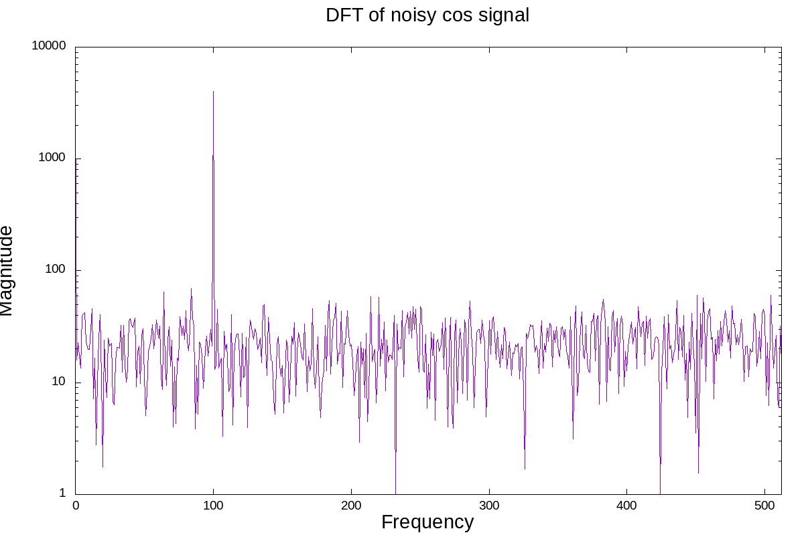

# Fortran - DFT z wykorzystaniem biblioteki FFTW
## Autor: Jakub Pilch
---
## 1. Strutkura projektu

Struktura projektu wygląda następująco:

    .
    ├── LICENSE
    ├── Makefile
    ├── README.md
    ├── res
    │   ├── filtered_cos_signal.png
    │   ├── filtered_cos_signal.txt
    │   ├── signal_cos_fft.png
    │   ├── signal_cos_noisy_fft.txt
    │   ├── signal_cos_noisy.png
    │   ├── signal_cos_noisy.txt
    │   ├── signal_sin_fft.png
    │   ├── signal_sin.png
    │   ├── signal_sin_sum_fft.txt
    │   └── signal_sin_sum.txt
    └── src
        ├── config.ff90
        ├── fftw.F90
        ├── main.F90
        ├── plots.plt
        └── utility.F90

### Katalogi zawierają:

+ **src** - kod źródłowy zadania oraz skrypt gnuplot rysujący wykresy
+ **res** - wyniki przeprowadzonych obliczeń oraz wykresy

### Opis plików:

+ **config.ff90** - zawiera definicje precyzji próbkowania oraz liczby π
+ **fftw.f90** - moduł dołączający interfejs biblioteki **FFTW**
+ **main.F90** - program główny
+ **utility.F90** - implementacja funkcji użytych w programie
+ **plots.plt** - skrypt rysujący wykresy

## 2. Kompilacja i uruchamianie

    $ make all
    $ ./main.out
    $ gnuplot src/plots.plt

## 3. Sprawozdanie

Zgodnie z poleceniem do obliczenia transformaty Fouriera wykorzystano funkcje biblioteki **FFTW**.

Pod uwagę były brane dwa sygnały, na przedziale **\[0,2π\]**:
**1.** x(t) = sin(2*π*t*200) + 2sin(2*π*t*400)
**2.** x(t) = cos(2*π*t*100) + r, gdzie r to niewielkie zaburzenie

Poniżej przedstawiono ich wykresy

### Transformata sygnału nr. 1

Poniższy wykres przedstawia wykres modułów uzyskanej transformaty w zależności od reprezentowanej częstotliwości.
Wyraźnie przedstawiają się dwie dominujące częstotliwości: **200Hz** oraz **400Hz**; co jest zgodne z definicją sygnału.
Dodatkowo można zaobserwować, stosunkową wielkość amplitud każdej ze składowych.

### Transformata sygnału nr. 2

Poniższy wykres przedstawia wykres modułów uzyskanej transformaty w zależności od reprezentowanej częstotliwości.
Widzimy dominującą częstotliwość **100Hz** i pewne zakłócenia w całym spektrum.

### Filtrowanie sygnału nr. 2

Operacja transformaty Fouriera, może zostać wykorzystana do filtracji niewielkich szumów z sygnału. Tak jak jest to widoczne na wcześniejszych wykresach moduły transformaty dla kluczowych częstotliowści sygnału wyraźnie odbiegają od wartości odpowiadających
zakłóceniom.
Korzystając z tego faktu i własności odwrotnej transformaty Fouriera można podjąć próbę filtracji sygnału, poprzez wyzerowanie częstotliwości, dla których amplitudy są stosunkowo niewielkie. Próg filtracji powinien stanowić pewien ułamek maksymalnej wartości moduły transformaty.

Poniżej przedstawiono wyniki takiej filtracji dla sygnału nr 2.

Sygnał udało się w całości "oczyścić".

## 4. Wnioski

+ Transformata Fouriera dostarcza narzędzi do analizy sygnałów stacjonarnych.
+ W ćwiczeniu wykorzystano proste sygnały jednowymiarowe, jednak te same operacje można zastosować dla przypadków wielowymiarowych (np. analiza obrazu), co podobnie pozwala uzyskać wiele informacji o sygnale.
+ Kluczowe jest zastosowanie w bibliotece algorytmu szybkiej transformaty Fouriera.